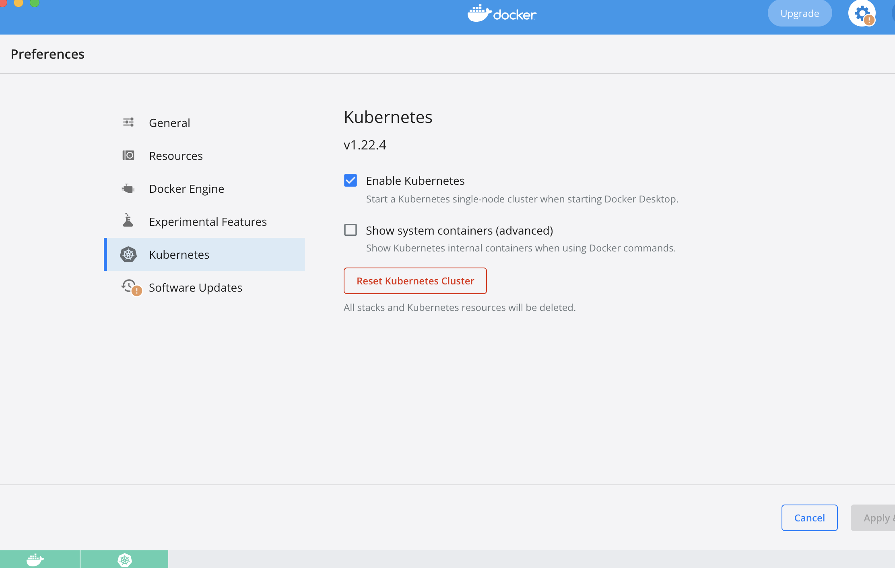
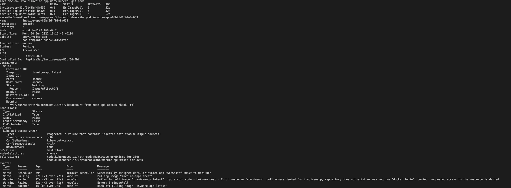
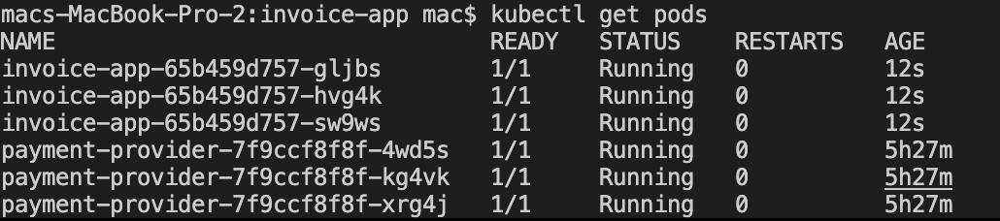

## Welcome

We're really happy that you're considering joining us!
This challenge will help us understand your skills and will also be a starting point for the next interview.
We're not expecting everything to be done perfectly as we value your time but the more you share with us, the more we get to know about you!

This challenge is split into 3 parts:

1. Debugging
2. Implementation
3. Questions

If you find possible improvements to be done to this challenge please let us know in this readme and/or during the interview.

## The challenge

Pleo runs most of its infrastructure in Kubernetes.
It's a bunch of microservices talking to each other and performing various tasks like verifying card transactions, moving money around, paying invoices, ...
This challenge is similar but (a lot) smaller :D

In this repo, we provide you with:

- `invoice-app/`: An application that gets invoices from a DB, along with its minimal `deployment.yaml`
- `payment-provider/`: An application that pays invoices, along with its minimal `deployment.yaml`
- `Makefile`: A file to organize commands.
- `deploy.sh`: A file to script your solution
- `test.sh`: A file to perform tests against your solution.

#### Observation:
Here, the `test.sh` file is missing

### Set up the challenge env

1. Fork this repository
2. Create a new branch for you to work with.
3. Install any local K8s cluster (ex: Minikube) on your machine and document your setup, so we can run your solution.


### ENVIRONMENT SETUP

I am running on macOS with Apple Silicon. Docker Desktop
- [Install Docker Destop on my MacBook Pro](https://docs.docker.com/desktop/mac/install/) - To setup Docker and Kubernetes
- From the Docker Desktop page, start Docker
- Go to Settings, Click on Kubernetes and Enable Kubernetes 
 [](./img/Start_Kubernetes.png) 

For  minikube setup, [use this](https://minikube.sigs.k8s.io/docs/start/) 

### Part 1 - Fix the issue

The setup we provide has a :bug:. Find it and fix it! You'll know you have fixed it when the state of the pods in the namespace looks similar to this:

```
NAME                                READY   STATUS                       RESTARTS   AGE
invoice-app-jklmno6789-44cd1        1/1     Ready                        0          10m
invoice-app-jklmno6789-67cd5        1/1     Ready                        0          10m
invoice-app-jklmno6789-12cd3        1/1     Ready                        0          10m
payment-provider-abcdef1234-23b21   1/1     Ready                        0          10m
payment-provider-abcdef1234-11b28   1/1     Ready                        0          10m
payment-provider-abcdef1234-1ab25   1/1     Ready                        0          10m
```


#### Requirements

Write here about the :bug:, the fix, how you found it, and anything else you want to share about it.

#### Solution

After lauching (`kubectl apply -f deployment.yaml`) in the `invoice-app` directory, to check the pod, I used `kubectl get pod` which shows a failing pod and I proceeded to check the reason for the failure of that pod using
`kubectl describe pod <name of the pod>`
Result here:
[](./img/k8s_failed_pod.png) 

Prior to resolving the main bug, I noticed that the image specified in the `deployment.yaml` in both invoice-app and payment-provider was not identified by docker-hub. So, I created the image on my personal dockerhub account and I made it public, built the images and push to my dockerhub registery account. I edited the `deployment.yaml` to suit this particular change

#### The Bug

After launching the application again (`kubectl apply -f deployment.yaml`), I checked the failing pods with command
(`kubectl describe pod <name of the pod>`) which shows the error message container has `Error: container has runAsNonRoot and image will run as root`. This means that the problem is in the USER of the Dockerfile being root.The security context constraints require both apps to run as non-root, but the images are configured to run as root, and so Kubernetes does not launch the pods.

#### The Fix

Two ways can be used to fix this particular issue. It is either I remove the requirement for the pods to run as non-root, or adjust the images not to run as root. However, for security preference it is better to run as non-root. So, adjusted the Dockerfiles, add user and added a group. Then attached a `uid` and `gid` to the users which I also specified in my deployment file. 

The pods are running below:
[](./img/Successful_k8.png) 

### Part 2 - Setup the apps

We would like these 2 apps, `invoice-app` and `payment-provider`, to run in a K8s cluster and this is where you come in

#### Requirements

1. `invoice-app` must be reachable from outside the cluster.
2. `payment-provider` must be only reachable from inside the cluster.
3. Update existing `deployment.yaml` files to follow k8s best practices. Feel free to remove existing files, recreate them, and/or introduce different technologies. Follow best practices for any other resources you decide to create.
4. Provide a better way to pass the URL in `invoice-app/main.go` - it's hardcoded at the moment
5. Complete `deploy.sh` in order to automate all the steps needed to have both apps running in a K8s cluster.
6. Complete `test.sh` in order to perform tests against your solution and get successful results (all the invoices are paid) via `GET invoices`.


##### Solution 1 & 2 
I created service definitions for both invoice-app and payment-provider, exposing invoice with NodePort and payment-provider with ClusterIP to make sure that invoice-app is available from the outside the cluster, the payment-provider is not. For preference and ease of work, I combined the service and deployment files for each application.

#### Solution 3
I added labels to my deployment.yaml and included the `strategy`, `livenessProbe`, `ports` and `resources`

#### Solution 4
 I created the configmap with the data provided, payment_url specified [here](https://github.com/pleo-io/sre-challenge/blob/master/invoice-app/main.go#:~:text=_%2C%20err%20%3D%20client.Post(%22http%3A//payment%2Dprovider%3A8082/payments/pay%22%2C%20%22application/json%22%2C%20data)).

#### Solution 5
The bash script to deploy both invoice-app and payment-provider is setup in the file `deploy.sh` ready to be automated in the file `Makefile`

#### Solution 6
No test.sh file present in the assessment sent. I mentioned this early in [observation](https://github.com/danade002/test/blob/main/README.md#observation:~:text=against%20your%20solution.-,Observation,-%3A)

### Part 3 - Questions

Feel free to express your thoughts and share your experiences with real-world examples you worked with in the past.

#### Requirements

#### 1. What would you do to improve this setup and make it "production ready"?

##### Solution
- Improved external access: Nodeport was used here and the reason for it is that it easier to use in this particular case and it's localhost but this is not good for production environment because it doesn't load-balance over more nodes, I have to use loadbalancer instead. For production environment, I will advise the use of ingress and ingress controller to enable ssl redirection (https) in other to secure the connection, to handle many request  

- Database: I will advise changing the database (here it's named "db") into a shared persistent data storage. Prefarably a managed database e.g. For AWS (RDS or DynamoDB for NoSQL), For Azure (Azure SQL, Azure Cosmos DB, and so on), For GCP (Google SQL Database, Google Cloud Databases)

- Image Version: Use image version tags instead of :latest

- Helm Chart: Use Helm Charts instead of plain kubernetes deployments

- CI/CD: use CI/CD a Pipeline to automate the deployment workflow instead of the makefile alone

- Test: Proper Testing of the application, automated and manual testing

- Network Policy: This is use to restrict access to the service needed. To make sure that only service needed can be able to connect to other service

#### 2. There are 2 microservices that are maintained by 2 different teams. Each team should have access only to their service inside the cluster. How would you approach this?

##### Solution:
By using namespaces to seperate the different teams. Each team will only have access to their own namespace which by extention use to separate the applications; shared-gateway can be use for cross-namespace routing.

#### 3. How would you prevent other services running in the cluster to communicate to `payment-provider`?

##### Solution
Isolating the `payment-provider` will prevent other services running in the cluster to communicate to `payment-provider` by creating a network policy that only allows ingress traffic to `payment-provider` from only `invoice-app`


##### Quick tip
For system running on minikube, to access the external endpoint,
use command `minikube service invoice-app --url` and copy the ip realtime address given

## What matters to us?
Of course, we expect the solution to run, but we also want to know how you work and what matters to you as an engineer.
So, feel free to use any technology you want!
You can create new files, refactor, rename, ...

Ideally, we'd like to see your progression through commits, verbosity in your answers and all requirements met.
Don't forget to update the README.md to explain your thought process.
